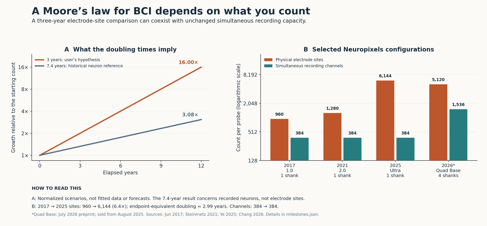

# Moore’s Law of Brain–Computer Interfaces

### Does invasive neural-interface capacity double every three years?

**Research snapshot: 15 September 2026**

## Answer

**Your observation captures a real increase in recording scale. A roughly three-year doubling is plausible for selected electrode-site comparisons, but this search does not establish it as a general law of invasive BCI—or as your lab’s historical cadence.**

Three findings explain the distinction:

1. **There is already a published precedent.** Stevenson and Kording’s 2011 study of 56 historical frontier studies estimated that simultaneously recorded neurons doubled every **7.4 ± 0.4 years**. This was a neuron-recording trend, not a count of physical probes or human BCI electrodes. [Original paper](https://doi.org/10.1038/nn.2731)
2. **A specific modern comparison closely matches three years.** Neuropixels 1.0 had **960 sites in 2017**; the final Neuropixels Ultra paper described **6,144 in 2025**. That 6.4-fold increase over eight rounded publication years implies an endpoint-equivalent doubling time of **2.99 years**. Both designs nevertheless had **384 simultaneous recording channels**. [Jun et al., 2017](https://doi.org/10.1038/nature24636), [Ye et al., 2025](https://doi.org/10.1016/j.neuron.2025.08.030)
3. **The Rice work supports substantial scaling, with changing units of comparison.** Early NET threads carried a few contacts; later modular implants reached thousands of monitored channels. That supports the direction of your observation, while leaving its exact rate unverified. [Luan et al., 2017](https://doi.org/10.1126/sciadv.1601966), [Zhao et al., online 2022](https://doi.org/10.1038/s41551-022-00941-y)

*Left: mathematical scenarios, not forecasts or fitted observations. Right: selected published device configurations. Ultra and Quad Base make different design tradeoffs; they are not successive points on one homogeneous technology curve. The 7.4-year reference concerns neurons.*

## 1. What should “more probes” mean?

| Quantity | A concrete interpretation |
|---|---|
| **Physical probes / shanks / threads** | Structures placed into tissue. One structure may carry a few contacts or thousands of selectable sites. |
| **Electrode sites** | Physical contacts available to sense or stimulate. Some arrays also count reference contacts in the total. |
| **Simultaneous channels** | Electrode signals the electronics can acquire concurrently at a stated sampling rate. |
| **Recorded neurons** | Units separated from the signals using an analysis procedure. One neuron can appear on several sites, and one site can detect several neurons. |
| **Useful BCI performance** | Successful communication or control, including errors, latency, stability, and calibration effort. |

For your hypothesis, the best initial hardware metric is **simultaneously recorded channels per subject**, with separate curves for interface type and implant duration. Also track working channels at fixed times after implantation. Physical site count remains useful for studying fabrication and spatial coverage.

The analogy to Moore’s law is reasonable: both concern sustained technological scaling. Moore’s transistor prediction was revised to approximately two-year doubling in 1975; it is not a physical rule that can simply be transferred to neural interfaces. [Intel historical account](https://www.intel.com/content/www/us/en/newsroom/resources/moores-law.html)

## 2. What the Luan–Xie publication history shows

I used the Rice **Lan Luan–Chong Xie** work as the local reference. The professor and exact lab-history interval were not confirmed, so this section reports public publications rather than private equipment ownership.

| First journal publication | Verified scale | What the count describes |
|---|---|---|
| **2017 — original NET** | **4 or 8 contacts per thread** | A basic ultraflexible penetrating probe. The 16 probes / 80 working electrodes mentioned across the study are pooled across seven mice. [Paper](https://doi.org/10.1126/sciadv.1601966) |
| **2019 — parallel implantation** | **32–128 contacts on 4–8 shanks per device** | One multi-shank device, rather than an entire animal’s maximum recording setup. [Paper](https://doi.org/10.1088/1741-2552/ab05b6) |
| **2022 online / 2023 issue — modular NET** | **18 × 128 = 2,304 simultaneously monitored channels; 144 shanks** | A large assembled penetrating implant. The module remains 128 channels; assembly and implantation scale contribute substantially. [Paper](https://doi.org/10.1038/s41551-022-00941-y) |
| **2026 — Luan–Xie–Chi collaboration** | **5,376 simultaneous channels at 20 kS/s** | An external acquisition headstage integrated with flexible surface μECoG electrodes and validated in rats. This is a different interface from penetrating NET. [Paper](https://doi.org/10.1038/s44385-026-00103-8) |

**Interpretation:** “8 → 128 → 2,304 → 5,376” would mix a thread, a module, an assembled penetrating implant, and a surface-recording platform. Fitting those numbers would produce a misleading lab growth rate. The primary NET paper’s 2,304 figure and an author review’s 1,930-channel description are not explicitly reconciled; neither is silently treated here as a verified usable-channel yield. [Author review](https://doi.org/10.1146/annurev-bioeng-090622-050507) Published capabilities also do not reveal typical day-to-day use. The [lab evidence notes](research/luan_xie_evidence.md) preserve the denominators and working-channel qualifications.

## 3. Other academic systems: count growth has several mechanisms

| System / publication | Physical sites per stated device | Simultaneous channels | Main lesson |
|---|---:|---:|---|
| Neuropixels 1.0, **2017**, one shank | 960 | 384 | Baseline for the illustrative site-count comparison. [Paper](https://doi.org/10.1038/nature24636) |
| Neuropixels 2.0, **2021**, one / four shanks | 1,280 / 5,120 | 384 in either version | More shanks and switchable sites increase reach without increasing simultaneous readout. [Paper](https://doi.org/10.1126/science.abf4588) |
| Neuropixels Ultra, **2025**, one shank | 6,144 | 384 | Dense spatial sampling; the active subset is smaller than the fabricated array. [Paper](https://doi.org/10.1016/j.neuron.2025.08.030) |
| Neuropixels Quad Base, **2026 preprint**, four shanks | 5,120 | 1,536 | Expanded readout electronics quadruple channels relative to original NP2.0. Commercial availability began August 2025. [Preprint](https://doi.org/10.64898/2026.07.23.740388), [project history](https://www.neuropixelscentral.org/technology) |
| BISC, **2025**, wireless surface chip | 65,536 | Up to 1,024 at 8.475 kS/s | A particularly clear selectable-sites versus concurrent-channels distinction; demonstrated in pigs and nonhuman primates. [Paper](https://doi.org/10.1038/s41928-025-01509-9) |

BISC also offers a **256-channel mode at 33.9 kS/s**. Sampling rate and signal bandwidth need to accompany channel counts in a fair comparison.

There is also a much larger acquisition backend: **Argo’s 2021 paper describes 65,536-channel capacity**, with **over 30,000 simultaneous surface field-potential channels demonstrated in sheep**. This was an acute research preparation; it is not a 65,536-channel chronic human implant. [Argo paper](https://doi.org/10.1088/1741-2552/abd0ce)

### How sensitive is the apparent doubling time?

Using rounded publication years and the same endpoint formula:

- NP1.0 → Ultra, **sites**: 960 → 6,144 over eight years → **2.99 years per doubling**.
- NP1.0 → single-shank NP2.0, **sites**: 960 → 1,280 over four years → **9.64 years**.
- NP1.0 → four-shank NP2.0, **sites**: 960 → 5,120 over four years → **1.66 years**, partly through quadrupling shanks.
- NP1.0 → Quad Base, **channels**: 384 → 1,536 → **4.5 years** using the 2026 preprint, or approximately **4 years** using 2025 availability.

These are **descriptive endpoint calculations**, not fitted laws. They show how design selection, metric, and dating convention change the answer. [Reproducible calculations](data/calculations.json)

## 4. How the companies relate

The examples below describe different approaches to invasive access. Electrode count alone does not rank their clinical usefulness.

| Organization | Selected verified milestone | Relationship to the scaling question |
|---|---|---|
| **Neuralink** | **2019:** 3,072-channel wired rat research platform. **N1:** nominal **1,024 electrodes on 64 threads**; first human implantation in January 2024. [2019 paper](https://doi.org/10.2196/16194), [PRIME brochure](https://neuralink.com/pdfs/PRIME-Study-Brochure.pdf), [human milestone](https://neuralink.com/updates/a-year-of-telepathy/) | The research prototype and fully implanted wireless human device have different constraints. Treating 3,072 → 1,024 as a single product scaling curve would be misleading. |
| **Blackrock / BrainGate studies** | **2006:** 96 recording electrodes on a 100-electrode human sensor. **2024:** four arrays recording from **256 electrodes** in a speech BCI. [2006 study](https://doi.org/10.1038/nature04970), [2024 study](https://doi.org/10.1056/NEJMoa2314132) | Human research advances include array placement, multiple arrays, decoding, and stability. These selected studies are not a complete company product history. |
| **Precision Neuroscience** | Company reported **4 × 1,024 = 4,096** surface electrodes streaming data during an April 2024 operation. [Company announcement](https://www.globenewswire.com/en/news-release/2024/05/28/2889069/0/en/Precision-Neuroscience-Announces-World-Record-for-Number-of-Electrodes-Placed-On-Human-Brain.html) | The increase came from using multiple arrays. It was temporary intraoperative recording. The **Layer 7-T clearance** concerns a passive array for **less than 30 days**, with no wireless functionality. [FDA record](https://www.accessdata.fda.gov/cdrh_docs/pdf24/K242618.pdf) |
| **Paradromics** | Connexus specification: **421 microelectrodes per cortical module**. Company announced its first chronic Connect-One human implantation on **17 June 2026**. [Device](https://paradromics.com/connexus/), [announcement](https://paradromics.com/news/paradromics-completes-first-human-brain-computer-interface-bci-implantation/) | Module specification and clinical milestone must stay separate: the announcement did not establish the participant’s exact implanted or functional channel count. |
| **Synchron** | **16-electrode Stentrode**, with 12-month follow-up in the 2023 SWITCH publication. [Clinical study](https://doi.org/10.1001/jamaneurol.2022.4847) | An endovascular interface records through a different geometry. Its lower contact count reflects a different access strategy and does not by itself imply inferior usefulness. |

A further counting detail: Precision’s 2025 paper describes the nominal 1,024 contacts as **977 recording-sized, 42 stimulation-optimized, and 5 references**. “1,024 electrodes” does not mean 1,024 equivalent neural inputs. [Design paper](https://doi.org/10.1038/s41551-025-01501-w)

## 5. Does more hardware produce better BCI performance?

There is encouraging direct evidence. In Willett et al.’s 2023 speech study, an offline channel-subsampling analysis found that doubling the number of electrodes multiplied word error rate by approximately **0.57** over the tested range. The participant had **256 electrodes implanted**, but the principal speech decoder used **128** from the relevant premotor arrays. This demonstrates the value of informative inputs within one study, without establishing an indefinite scaling law. [Paper, Fig. 4 and Extended Data Fig. 1](https://doi.org/10.1038/s41586-023-06377-x)

**My assessment:** a stronger version of your Big Idea is to study two related relationships:

1. **Calendar time → useful neural access:** how many stable, simultaneously usable channels can be maintained under specified practical constraints?
2. **Useful neural access → task performance:** what improvement follows from adding channels while holding the task, training data, decoder evaluation, and implant age comparable?

That separates electronics and implantation progress from the scientific question of how much additional information the brain signals contain. A valuable study could locate where nominal count growth stops producing proportional gains, and which bottleneck—coverage, signal stability, readout, or decoding—accounts for the gap.

## 6. What is established, and what remains open?

**Established by this search:** a historical neuron-recording exponential trend; a selected modern site-count comparison close to three-year doubling; substantial Luan–Xie scaling; and several company paths toward hundreds or thousands of contacts.

**Still open:** a representative, field-wide doubling rate for invasive electrical BCI; a regular three-year cadence in your particular lab; and a universal relationship between nominal electrode count and useful information transfer.

The [methods and lab-history template](METHODS.md) define how to test those questions. The [20-milestone dataset](data/milestones.json) is a checked starting point, with missing values and evidence types retained. A full historical regression would require a systematic inclusion rule and a larger comparable series. For recorded-neuron history specifically, the [Urai et al. 2022 author repository](https://github.com/anne-urai/largescale_recordings) provides a useful existing data/code foundation.

**Suggested framing for the project:** *“Moore’s Law of BCI: scaling electrode sites, simultaneous channels, and stable useful neural access.”*
